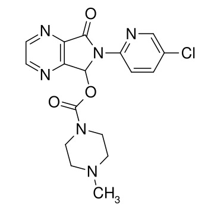

# 佐匹克隆（Zopiclone）
## 一、基础信息
| 项目         | 详情                                                                 |
|--------------|----------------------------------------------------------------------|
| 药物分类     | Z药物、第三代镇静催眠药、环吡咯酮衍生物（非苯二氮䓬类）               |
| 别名         | 唑吡酮                                                               |
| 适应症       | 治疗失眠                                                             |
| 管制等级     | 第二类精神药品                                                       |
| 化学式       | C₁₇H₁₇ClN₆O₃                                                         |
| CAS号        | 43200-80-2（游离碱形式）                                             |
| 相关图片     |  |

## 二、作用机理
- 激动受体：GABAₐ（轻微选择亲和α1/α5亚基）
- 正构受体：GABAₐ
- 拮抗受体：烟碱乙酰胆碱

## 三、药物动力学数据
| 指标         | 详情                                                                 |
|--------------|----------------------------------------------------------------------|
| 生物利用率   | 52-59%                                                               |
| 药物代谢     | 多种细胞色素 P450 肝酶催化                                           |
| 生物半衰期   | ~5-9 小时                                                            |
| 排泄途径     | 主要通过尿液排泄                                                     |

## 四、药效
1. 核心作用：镇静、安眠、肌松、抗焦虑、抗惊厥
2. 特殊作用（与同为Z药物的唑吡坦相似）：
   - 社交能力增强
   - 抗焦虑、抗抑郁
   - 极大的兴奋
3. 作用关联：激动GABAₐ受体时对α1/α5亚基的轻微选择性亲和，是上述心理作用的主要原因

## 五、不良反应
### 1. 短期副作用
- 困倦、口苦、口干、肌无力、头痛

### 2. 长期副作用（突然停药可出现）
- 反跳性失眠、噩梦、恶心、呕吐、焦虑、肌痛、震颤

### 3. 罕见副作用
- 痉挛、肌肉颤抖、意识模糊、性欲障碍

### 4. 未知副作用
- 躁动、谵妄、妄想、精神错乱、共济失调、呼吸抑制

## 六、禁忌症
下列情况禁止使用本品：
1. 对佐匹克隆或任何其他成分过敏者
2. 重症肌无力患者
3. 严重呼吸功能不全患者
4. 重度睡眠呼吸暂停综合征患者
5. 严重的急性或慢性肝脏功能不全患者（存在发生肝性脑病的危险性）
6. 对谷蛋白过敏或不耐受的患者（药物含小麦淀粉［谷蛋白］）

## 七、注意事项
- 过量风险：过量服用可导致深睡或昏迷
- 用药时长：不宜过长，一般不超过4周，可间断使用
- 活动限制：用药期间不宜驾车或从事机械操作
- 停药方式：须逐渐减量，不可突然停药
- 饮食禁忌：用药期间禁止饮酒

## 八、药物相互作用
- 与神经肌肉阻滞药、中枢神经抑制药合用：镇静作用增强
- 与甲氧氯普胺合用：甲氧氯普胺增加佐匹克隆的血药浓度
- 与卡马西平合用：佐匹克隆峰浓度升高，卡马西平峰浓度降低
- 与红霉素合用：红霉素增加佐匹克隆AUC和t1/2，可能伴随精神运动障碍
- 与阿托品、利福平合用：使佐匹克隆的浓度降低
- 与苯二氮䓬类催眠药合用：增加戒断症状

---

# 去甲佐匹克隆（Norzopiclone）
## 一、基础信息
| 项目         | 详情                                                                 |
|--------------|----------------------------------------------------------------------|
| 药物属性     | 佐匹克隆在体内的主要代谢产物之一                                     |
| 管制等级     | 并未上市                                                             |
| 化学式       | C₁₆H₁₅ClN₆O₃                                                         |
| CAS号        | 59878-63-6（游离碱形式）                                             |

## 二、药理特性
- 作用与母体药物佐匹克隆类似，但催眠作用微弱或缺乏
- 仍具有一定的抗焦虑特性
- 作用靶点：GABA-A受体及多巴胺D2受体，发挥镇静、催眠和抗焦虑作用

## 三、药代动力学数据
| 指标         | 详情                                                                 |
|--------------|----------------------------------------------------------------------|
| 代谢与形成   | 佐匹克隆通过去甲基化代谢途径产生，约15%的口服剂量转化为该代谢物       |
| 生物半衰期   | 7至11小时                                                            |
| 血浆蛋白结合率 | 52%-59%                                                              |
| 排泄途径     | 主要在肝脏经细胞色素P450酶系（尤其是CYP3A4和CYP2E1）代谢，代谢产物主要经尿液排泄，少量经粪便排出，原形药物在尿液中排泄极少 |

---

# 右佐匹克隆（Eszopiclone）
## 一、基础信息
| 项目         | 详情                                                                 |
|--------------|----------------------------------------------------------------------|
| 药物分类     | 非苯二氮类短期镇定催眠剂、环吡咯酮类化合物                           |
| 活性形式     | 佐匹克隆右旋异构物                                                   |
| 管制等级     | 第二类精神药品                                                       |
| 化学式       | C₁₇H₁₇ClN₆O₃（与佐匹克隆相同）                                       |
| CAS号        | 138729-47-2（游离碱形式）                                             |

### 主编吐槽
右佐匹克隆作为安眠药最主要的副作用就是苦得要死——不是吃的时候苦，是吃完苦一整天，吃什么都是苦的，嘴里口水都发苦。作为od药物时，不仅效果有限，幻觉全看运气，还会苦到难以忍受，不推荐od使用。

## 二、药物动力学数据
| 指标         | 详情                                                                 |
|--------------|----------------------------------------------------------------------|
| 血浆蛋白结合率 | 52-59%                                                              |
| 药物代谢     | 肝脏中氧化及去甲基化（CYP3A4与CYP2E1酶催化）                         |
| 生物半衰期   | 6小时                                                                |
| 排泄途径     | 肾脏                                                                 |
| 吸收特性     | 口服吸收快，约1~1.3小时达到血药峰值                                   |

## 三、作用机理
作为GABAₐ受体激动剂，作用位点在苯二氮类受体上，通过氧化或去甲基化代谢发挥作用。

## 四、不良反应
### 1. 常见症状
- 口中有不舒服的苦味和金属味、头痛、胸痛、感冒症状、口干、白天睡意浓厚、头昏、肠胃不适、性欲降低

### 2. 较少见症状
- 皮疹、瘙痒、不协调、背痛、排尿疼痛

### 3. 特殊风险
- 服用后未马上入睡或仅短暂入睡，醒来时可能出现头晕及其他不适

## 五、依赖性
- 可能造成精神、生理上的依赖性，有酗酒和药物滥用习惯的人群成瘾风险更高
- 长期使用会产生耐受性，需逐渐增加药量以达到同等效果

## 六、用量规范
### 1. 常规推荐剂量
| 人群/药物     | 剂量标准                                                             |
|--------------|----------------------------------------------------------------------|
| 佐匹克隆（成人） | 临睡前服7.5 mg                                                       |
| 佐匹克隆（老年/体弱/肝功能不全） | 临睡前服3.75 mg                                                     |
| 右佐匹克隆（成人起始） | 入睡前2 mg，可根据临床需要增至3 mg                                   |
| 右佐匹克隆（老年入睡困难） | 起始剂量1 mg，必要时可增至2 mg                                       |
| 右佐匹克隆（老年睡眠维持障碍） | 入睡前2 mg                                                           |

### 2. 分级剂量（以60kg、无耐药性、左右旋体混合为标准）
- 医学剂量：1t（每日睡前服用）
- 起效剂量：2mg
- 轻度剂量：3.5~5mg
- 中度剂量：5~7.5mg
- 高度剂量：7.5~15mg
- 重度剂量：15mg+
- 死亡剂量：未知
- 特殊说明：若使用右佐匹克隆，剂量需相较于混合体减半

### 3. 药效时间（以距离服药已过去的时间为标准）
- 起效时：10~30min
- 顶峰时：3~4h
- 总效时：3.5~9h

### 4. 剂量调整原则
体重不同对应剂量不同，上述剂量针对60kg人群。个人剂量=（自身体重÷60）× 上述标准剂量