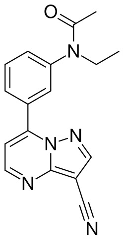

# 扎来普隆（Zaleplon）
## 一、基础信息
| 项目         | 详情                                                                 |
|--------------|----------------------------------------------------------------------|
| 药物分类     | 非苯二氮卓类、Z-吡唑并嘧啶类镇静催眠药、新型安眠药、抗入睡困难药、镇静剂与内部幻觉剂 |
| 别名         | 海波隆（引用自《NEEDY GRIL OVERDOSE》的药物「海波隆CP」）             |
| 适应症       | 治疗失眠症（主要针对入睡困难）                                         |
| 化学式       | C₁₇H₁₅N₅O                                                            |
| CAS号        | 151319-34-5（游离碱形式）                                             |
| 相关图片     |  |

## 二、作用机理
### 1. 受体作用
- 激动受体：GABAₐ（α亚单位的ω-1受体）
- 正构受体：GABAₐ

### 2. 作用特点
- 高选择性、高亲和力配体，可与GABAₐ受体上苯二氮卓类药物位点结合并正向调节
- 优先结合含α1的GABAₐ受体（原称BZ1/Ω1受体），该位点主要介导镇静作用
- 与部分含α2和α3的GABAₐ受体（介导抗焦虑、肌肉松弛作用）具有相当亲和力，此选择性高于劳拉西泮或佐匹克隆
- 与唑吡坦的区别：唑吡坦对α2、α3亚基亲和力较低，扎来普隆在这些位点亲和力更高

## 三、药物动力学数据
| 指标         | 详情                                                                 |
|--------------|----------------------------------------------------------------------|
| 生物利用率   | 30%（口服）                                                          |
| 药物代谢     | 主要经肝醛氧化酶（91%）代谢，少量经CYP3A4（9%）代谢                  |
| 代谢产物     | 无活性代谢物（5-氧代扎来普隆、去乙基扎来普隆等）                     |
| 起效时间     | 10-30min                                                             |
| 血药达峰时间 | 45min以内                                                            |
| 消除半衰期   | 1小时                                                                |
| 作用持续时间 | 大约4至6小时                                                         |
| 排泄途径     | 肾脏                                                                 |

### 补充说明
- 扎来普隆的半衰期仅1小时，代谢受醛氧化酶抑制剂或诱导剂影响
- 约9%的扎来普隆经CYP3A4代谢为去乙基扎来普隆，后者再经醛氧化酶代谢为5-氧代去乙基扎来普隆

## 四、药效
1. 核心效果：改善睡眠潜伏期，显著缩短入睡时间，更擅长诱导睡眠而非维持睡眠
2. 辅助效果：可缓解半夜觉醒，但对减少过早觉醒效果有限，且未证实能增加总睡眠时间
3. 安全优势：睡前服用后，早晨或半夜服药4小时后对驾驶表现无显著影响；与苯二氮卓类药物相比，副作用更少
4. 风险提示：包括扎来普隆在内的安眠药与死亡风险增加有关
5. 特性对比：化学强化作用不强，反弹效应远小于其他非苯二氮卓类（Z药物）

## 五、不良反应
### 1. 主要作用（治疗相关）
- 镇静、强化入眠、梦境增强

### 2. 主要副作用
- 记忆削弱、头晕、顺行性遗忘

### 3. 其他特点
- 不良反应与苯二氮卓类药物相似，但次日镇静作用较弱
- 临床研究显示，使用扎来普隆不会导致交通事故发生率增加

## 六、药物相互作用
- 与CYP3A4诱导剂（利福平、苯妥英、卡马西平、苯巴比妥等）合用：降低扎来普隆有效性，建议更换催眠药物
- 与硫利达嗪合用：镇静作用增强（可能是叠加效应或药物相互作用）
- 与苯海拉明（弱醛氧化酶抑制剂）合用：未发现影响扎来普隆药代动力学

## 七、用量规范
### 1. 标准剂量（以60kg、无耐药性为标准）
- 医学剂量：5~10mg/次，每日睡前服用
- 滥用剂量：不明

### 2. 药效时间
- 【缺少数据】

### 3. 剂量调整原则
体重不同对应剂量不同，上述剂量针对60kg人群。个人剂量=（自身体重÷60）× 上述标准剂量