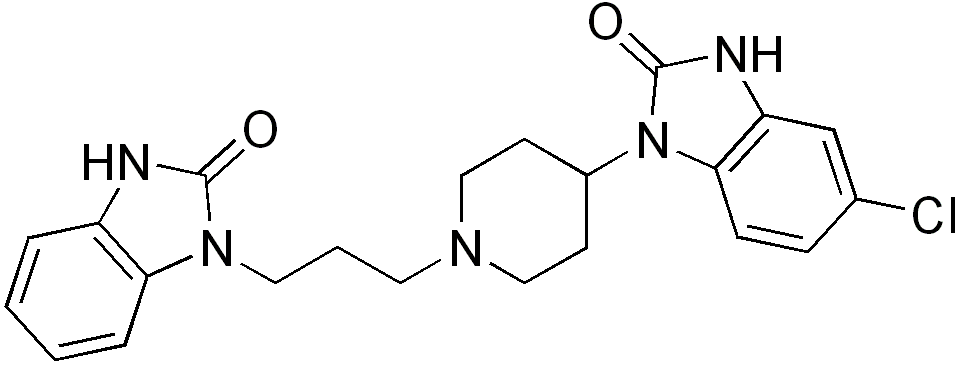

# 多潘立酮（Domperidone）
## 一、基础信息
| 项目         | 详情                                                                 |
|--------------|----------------------------------------------------------------------|
| 别名         | 吗丁啉                                                               |
| 药物分类     | 抗多巴胺类药物                                                       |
| 核心用途     | 抑制恶心和呕吐，促进乳汁分泌                                         |
| 化学式       | C₂₂H₂₄ClN₅O₂                                                         |
| CAS号        | 57808-66-9                                                           |
| 相关图片     |  |
| 给药方式     | 口服、静脉注射、直肠给药                                             |

### 主编吐槽
多潘立酮的止吐效果能给到7.5/10，比甲氧氯普胺效果好。它能促进泌乳，对药娘很友好，但有可能影响某些od药物的药效，总体是一款优秀的止吐和抑制恶心的药物。

## 二、作用机理
### 1. 抗催吐作用
- 拮抗外周多巴胺受体，直接作用于胃肠壁。
- 增加食道下部括约肌张力，增强胃蠕动，促进胃排空协调，调节胃与十二指肠运动。

### 2. 催乳作用
- 刺激脑垂体催乳激素的释放，进而促进乳汁分泌。

## 三、药物动力学数据
| 指标         | 详情                                                                 |
|--------------|----------------------------------------------------------------------|
| 生物利用率   | 高                                                                   |
| 核心结合蛋白质率 | 91–93%                                                               |
| 药物代谢     | 主要在肝脏代谢                                                       |
| 生物半衰期   | 7小时                                                                |
| 排泄途径     | 母乳、肾脏                                                           |

## 四、用途及用量
### 1. 适应症
- 消化不良症（由胃排空延缓、胃食道反流、食道炎引起）：上腹部胀闷感、腹胀、上腹疼痛、嗳气、肠胃胀气、恶心、呕吐、胃烧灼感（伴或不伴反流胃内容物）。
- 各类恶心呕吐：功能性、器质性、感染性、饮食性、放射性治疗或化疗引起的恶心呕吐。
- 特效适应症：多巴胺受体激动剂（如左旋多巴、溴隐亭等）治疗帕金森氏症所引起的恶心和呕吐。

### 2. 用法用量（口服）
- 成人：每日3-4次，每次1片；必要时剂量可加倍或遵医嘱。
- 儿童（12岁以上及35千克以上）：每日3-4次，每次每公斤体重0.3毫克。
- 服用时间：饭前15-30分钟服用；饭后服用会延迟吸收。
- 日最高剂量：80毫克。

## 五、禁忌症与不良反应
### 1. 禁忌症
下列情况禁用于本品：
1. 已知对多潘立酮或本品任一成份过敏者。
2. 增加胃动力可能产生危险的情况（胃肠道出血、机械性梗阻、穿孔）。
3. 分泌催乳素的垂体肿瘤（催乳素瘤）患者。
4. 合用酮康唑口服制剂、红霉素或其他可能延长QTc间期的CYP3A4酶强效抑制剂（如氟康唑、伏立康唑、克拉霉素、胺碘酮、泰利霉素）。

### 2. 不良反应
#### （1）常见副作用
- 心脏QTc延长，存在室性心律不齐的风险。

#### （2）罕见副作用
- 胃肠道不适（含非常罕见的一过性肠痉挛）、溢乳、闭经、男子乳房女性化、兴奋、神经过敏。

#### （3）极罕见副作用
- 过敏反应（含过敏性休克、血管神经性水肿）、锥体外系副作用、惊厥、嗜睡、头痛、皮疹、瘙痒、荨麻疹、肝功能检验异常。

#### （4）副作用补充说明
- 多潘立酮可能引起催乳素水平升高，罕见情况下导致溢乳、男子乳房女性化、闭经等神经-内分泌副作用。
- 锥体外系症状在小儿和成人中均极罕见，停药后可自行完全恢复。
- 惊厥、兴奋、嗜睡等中枢神经系统反应极罕见，主要在婴儿和儿童中报告。

## 六、注意事项
- 乳糖相关禁忌：本品含乳糖，乳糖不耐受、半乳糖血症或葡萄糖/半乳糖吸收障碍患者慎用。
- 药物合用时间：抗酸剂或抑制胃酸分泌药物需于饭后服用，不宜与本品同时服用（避免降低本品口服生物利用度）。
- 肝功能损害患者：惧用（本品主要在肝脏代谢）。
- 严重肾功能不全患者（血清肌酐>6毫克/100ml 即>0.6mmol/L）：消除半衰期延长至20.8小时，单次服药可能无需调整剂量；重复给药时，需将服药频率减为每日1-2次，剂量酌减，长期用药需定期检查。
- 储存要求：置于儿童不易拿到处。

## 七、药物相互作用
### 1. 拮抗或降低药效的合用
- 与抗胆碱药合用：拮抗本品治疗消化不良的作用。
- 与抗酸剂、抑制胃酸分泌药物合用：降低本品口服生物利用度，不宜同时服用。

### 2. 增加本品血药浓度的合用
- 多潘立酮主要经CYP3A4酶代谢，与CYP3A4酶强效抑制剂合用会导致其血药浓度增加，此类抑制剂包括：
  - 唑类抗真菌药物（氟康唑、伊曲康唑、酮康唑、伏立康唑）
  - 大环内酯类抗生素（红霉素、克拉霉素）
  - HIV蛋白酶抑制剂（安泼那韦、阿扎那韦、福沙那韦等）
  - 钙拮抗剂（地尔硫萆、维拉帕米）
  - 其他（胺碘酮、阿瑞吡坦、奈法唑酮、泰利霉素）
  - 注：标*药物（氟康唑、酮康唑、伏立康唑、克拉霉素、胺碘酮、泰利霉素）同时会延长QTc间期，属禁忌合用范畴。

### 3. 其他合用影响
- 与口服缓释/肠衣制剂合用：理论上影响后者吸收；但与地高辛、对乙酰氨基酚合用时，不影响其稳定血药浓度。
- 与神经抑制剂合用：不增强神经抑制剂的作用。
- 与多巴胺能激动剂（溴隐亭、左旋多巴）合用：减少后者外周副作用（消化道症状、恶心呕吐），不拮抗其中枢作用。