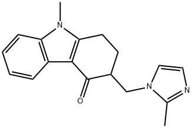

# 昂丹司琼（Ondansetron）
## 一、基础信息
| 项目         | 详情                                                                 |
|--------------|----------------------------------------------------------------------|
| 药物分类     | 高选择性血清素 5-HT₃受体拮抗剂                                       |
| 核心用途     | 预防手术、化疗、放疗后的恶心呕吐；治疗胃肠炎（对动晕症几乎无治疗效果） |
| 化学式       | C₁₈H₁₉N₃O                                                            |
| CAS号        | 103639-04-9（盐酸盐形式）                                             |
| 相关图片     |  |
| 给药方式     | 口服给药、肌肉注射、静脉注射                                         |

## 二、药物动力学数据
| 指标         | 详情                                                                 |
|--------------|----------------------------------------------------------------------|
| 生物利用度   | ~60%                                                                 |
| 血浆蛋白结合率 | 70%-76%                                                               |
| 药物代谢     | 主要在肝脏代谢                                                       |
| 生物半衰期   | 5～7小时                                                             |
| 排泄途径     | 肾脏                                                                 |

## 三、药理学
### 1. 药代动力学
- 口服吸收迅速，单次口服8mg后1.5h血药浓度达峰值（30ng/mL）。
- 迅速分布到全身各组织，表观分布容积（Vᵈ）为140L，可经乳汁分泌。
- 口服与静脉注射代谢相似，半衰期β相约为3h，重复给药不改变药代动力学。
- 代谢产物主要经粪便和尿液排泄，50%以内以原形自尿排出。

### 2. 药理作用
- 强效、高度选择性5-羟色胺受体拮抗药，止吐疗效优于甲氧氯普胺，对顺铂等强致吐化疗药引起的呕吐抑制迅速且强大。
- 对晕动病及阿扑吗啡引起的呕吐无效，对手术后恶心呕吐的作用机制不详。
- 作用机制（推测）：阻断化疗/放疗诱导的小肠嗜铬细胞释放5-HT与5-HT₃受体结合，抑制迷走传入神经兴奋引发的呕吐反射（比甲氧氯普胺强100倍）；同时拮抗中枢5-HT₃受体，阻断第四脑室后支区5-HT触发的呕吐。
- 辅助作用：止吐剂量下可增强胃排空，减轻恶心；对中枢神经系统有抗焦虑和地西泮样作用，抑制呕吐中枢兴奋。

## 四、用途及用量
### 1. 适应症
- 预防和治疗化疗、放疗引起的恶心呕吐（对顺铂等抗癌药引起的呕吐效果显著）。
- 文献报道可用于预防和治疗手术后引起的恶心呕吐。

### 2. 用法用量
| 给药方式     | 剂量与用法                                                           |
|--------------|----------------------------------------------------------------------|
| 口服给药     | 每次8mg，间隔12h再服8mg；每天2次，连服5天                            |
| 静脉注射     | 缓慢静注8mg，间隔2～4h再缓慢静注8mg（共2次）；每天2次，连用5天        |
| 静脉滴注     | 4mg 加入50～100mL生理盐水，滴注时间15min                             |

## 五、禁忌症与不良反应
### 1. 禁忌症
- 有过敏史或对昂丹司琼过敏者
- 胃肠道梗阻患者
- 孕妇、哺乳妇女禁用

### 2. 不良反应
#### （1）常见/已知不良反应
- 肝功相关：中度及高度肝功不良者需控制剂量，肝功恶化时需用保肝药物。
- 胃肠道：大便干结、腹胀（抑制肠道蠕动所致，严重者可持续5～7天，可通过调整饮食、运动或联用胃肠动力药缓解，多可自行恢复）。
- 皮肤：注射周围皮肤斑疹、皮疹或一过性发红。

#### （2）少见/偶见不良反应
- 少见：头痛、眩晕、心动过速、胸部不适（均为一过性，无需处理或对症处理即可）。
- 偶见：静坐不能、支气管痉挛、腹泻、癫痫大发作、低钾血症。

#### （3）其他不良反应
- 部分患者可出现短暂性无症状的氨基转移酶升高。
- 曾有即刻过敏反应的报道。

## 六、注意事项
- 过敏体质者慎用。
- 少儿、老人：需控制剂量，每天不超过0.15mg/kg；老年人及肝功不良者消除半衰期可延长至5h或更长，需严格控量。
- 孕妇：安全性尚未确定，不推荐早孕期间使用。
- 肾脏损害患者：无需调整剂量、用药次数及给药途径。
- 药物超量：不良反应发生率会增加，需避免。
- 储存要求：30℃以下避光保存。
- 静脉注射：速度须缓慢。

## 七、药物相互作用
- 与地塞米松或甲氧氯普胺合用：止吐效果更佳。
- 与肝P450酶诱导剂/抑制剂合用：可能改变昂丹司琼清除率和半衰期，目前无足够资料指导剂量调整。
- 与卡莫司汀、依托泊苷、顺铂合用：不影响昂丹司琼的代谢。