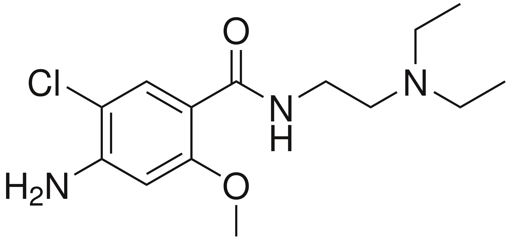

# 甲氧氯普胺（Metoclopramide）
## 一、基础信息
| 项目         | 详情                                                                 |
|--------------|----------------------------------------------------------------------|
| 药物分类     | D₂受体拮抗剂、5-HT₃受体拮抗剂、5-HT₄受体激动剂及催乳素调节剂           |
| 化学类别     | 取代苯甲酰胺（与西沙必利、莫沙必利化学结构相似，后两者为促胃肠蠕动剂） |
| 核心用途     | 治疗恶心、呕吐、胃轻瘫、胃食道逆流疾病；治疗偏头痛                     |
| 化学式       | C₁₄H₂₂ClN₃O₂                                                         |
| CAS号        | 54143-57-6（盐酸盐形式）                                             |
| 相关图片     |  |
| 给药途径     | 口服给药、静脉注射、肌肉注射、鼻喷剂                                   |

## 二、药物动力学数据
| 指标         | 详情                                                                 |
|--------------|----------------------------------------------------------------------|
| 生物利用度   | 80 ± 15% (口服)                                                      |
| 药物代谢     | 主要在肝脏代谢，经CYP2D6（可逆性抑制该酶）及多种CYP酶进行N-羟基化、N-去乙基化 |
| 生物半衰期   | 5-6小时                                                              |
| 排泄途径     | 尿液：70–85%；粪便：2%                                               |

## 三、药理学与作用机制
### 1. 受体作用特性
- 以奈米摩尔级亲和力（Ki值28.8nM）结合多巴胺D₂受体，作为受体拮抗剂。
- 混合型5-HT₃受体拮抗剂与5-HT₄受体激动剂。

### 2. 核心作用机制
- 止吐作用：通过拮抗脑部化学感受器触发区的D₂受体，阻止多数刺激引发的恶心呕吐。
- 胃肠调节：增强下食道括约肌张力，发挥胃肠动力药作用。
- 情绪影响：通过对5-HT₃受体的拮抗和5-HT₄受体的激动，可能影响使用者情绪。

## 四、药效与副作用
### 1. 核心药效
- 胃肠动力调节：改善消化不良、胃部胀满、胃酸过多、胃排空障碍。
- 止吐：缓解尿毒症、急性放射线症候群、癌症化疗、分娩、感染等相关恶心呕吐。
- 辅助治疗：与扑热息痛/阿司匹林合用治疗偏头痛；辅助小肠检查（缩短钡剂通过时间）。

### 2. 副作用分类
#### （1）常见副作用
- 静坐不能、局部肌张力不全、昏睡、烦燥不安、疲怠无力、疲劳、腹泻

#### （2）少见副作用
- 乳腺肿痛、恶心、便秘、皮疹、睡眠障碍、眩晕、严重口渴、头痛、容易激动、高血压、低血压、高泌乳素血症（可致乳溢症）、锥体外症候群（如动眼危象）

#### （3）罕见副作用
- 恐慌症、严重忧郁疾患、特定场所畏惧症、颗粒性白血球缺乏症、室上性心搏过速、醛固酮增多症、抗精神药物恶性症候群、迟发性运动不能、正铁血红蛋白血症

#### （4）用药警示
- 不建议持续服用超过12周，避免严重副作用风险。
- 孕妇服用后未发现明确母婴伤害证据，但需谨慎使用。

## 五、用量规范
### 1. 常规用量（口服）
| 人群         | 剂量与用法                                                           |
|--------------|----------------------------------------------------------------------|
| 成人         | 常规：每次5～10mg（1-2片），每日3次； 糖尿病性胃排空障碍：症状出现前30分钟服10mg，或餐前及睡前服5～10mg，每日4次； 总剂量：每日不超过0.5mg/kg |
| 小儿（5～14岁） | 每次2.5～5mg（0.5-1片），每日3次，餐前30分钟服，宜短期服用； 总剂量：每日不超过0.1mg/kg |

### 2. 药物过量
- 过量症状：深昏睡、神智不清；颈部/背部肌肉痉挛、拖曳步态、头面部抽搐、双手颤抖摆动等锥体外系症状。
- 应对措施：使用抗胆碱药物、帕金森病治疗药物或抗组胺药，可制止锥体外系反应。

## 六、治疗用途细分
1. 恶心呕吐相关：缓解尿毒症、急性放射线症候群、癌症化疗、分娩、感染等引发的恶心、呕吐、嗳气、消化不良、胃部胀满、胃酸过多。
2. 偏头痛：与扑热息痛（乙酰胺酚）或乙酰水杨酸（阿司匹林）合用。
3. 胃轻瘫：治疗糖尿病性胃轻瘫、尿毒症、硬皮病等胶原疾患所致胃排空障碍。
4. 泌乳：可用于增加乳汁分泌，但有效性和安全性证据不充分。
5. 医疗辅助：静脉注射用于小肠追踪检查、小肠灌肠和放射性核素胃排空研究，缩短钡剂通过时间，预防检查相关呕吐。

## 七、禁忌及注意事项
### 1. 禁忌症
下列情况禁用：
1. 对普鲁卡因或普鲁卡因胺过敏者。
2. 癫痫患者（用药会增加发作频率与严重性）。
3. 胃肠道出血、机械性肠梗阻或穿孔患者（用药会加重病情）。
4. 嗜铬细胞瘤患者（用药可能引发高血压危象）。
5. 因化疗和放疗呕吐的乳癌患者。

### 2. 慎用情况
- 肝功能衰竭患者（丧失蛋白结合能力）。
- 重症慢性肾功能衰竭患者（锥体外系反应风险升高，需减量）。

### 3. 注意事项
- 用药后可能导致醛固酮与血清催乳素浓度升高。
- 严重肾功能不全患者剂量至少减少60%。
- 与西咪替丁合用需间隔至少1小时（避免降低西咪替丁口服生物利用度）。
- 药物遇光变黄色或黄棕色后，毒性增高，不可使用。

## 八、药物相互作用
### 1. 增强吸收/效能
- 与对乙酰氨基酚、左旋多巴、锂化物、四环素、氨苄青霉素、乙醇、安定、环孢霉素合用：胃排空增快，后者小肠吸收增加。
- 与乙醇或中枢抑制药合用：镇静作用增强。

### 2. 拮抗作用
- 与抗胆碱能药物、麻醉止痛药物、抗毒蕈碱麻醉性镇静药合用：甲氧氯普胺的胃肠道能动性效能被抵消。

### 3. 其他风险
- 与单胺氧化酶抑制剂合用（高血压患者）：需监控血压（甲氧氯普胺可释放儿茶酚胺）。
- 与阿扑吗啡合用：抑制阿扑吗啡的中枢性与周围性效应。
- 与慢溶型地高辛合用：降低地高辛胃肠道吸收，间隔2小时服用可减少影响；同时增加地高辛胆汁排出，改变其血浓度。
- 与吩噻嗪类等可导致锥体外系反应的药物合用：锥体外系反应发生率与严重性增加。